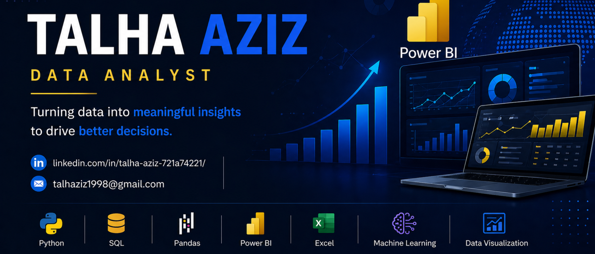

# Hi, I'm Talha 

## Aspiring Data Analyst

I am passionate about turning data into meaningful insights using Python, SQL, and visualization tools.

---

## Skills
- Python 
- Pandas & NumPy
- SQL
- Excel
- Power Bi
- Machine Learning (Basics)

---

## Projects

### Wine Quality Analysis
- Performed EDA and built ML model  
- Identified key factors affecting wine quality  
- Improved model using Random Forest  

🔗 https://github.com/talha-analytics/wine-quality-analysis

---

## Goals
- Become a Data Analyst  
- Work on real-world data projects  
- Build strong portfolio  

---

## Connect with me
- GitHub: https://github.com/talha-analytics
